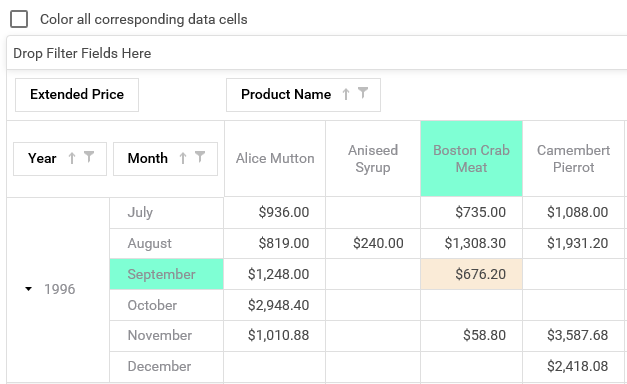

<!-- default badges list -->

[](https://supportcenter.devexpress.com/ticket/details/T621056)
[](https://docs.devexpress.com/GeneralInformation/403183)
<!-- default badges end -->
# Pivot Grid for Web Forms - How to highlight field and data cells corresponding the hovered cell
<!-- run online -->
**[[Run Online]](https://codecentral.devexpress.com/t621056/)**
<!-- run online end -->
This example illustrates how to highlight field and data cells corresponding to the hovered cell:



Since ASPxPivotGrid does not support this scenario out of the box, the only possible way is implementing this task using jQuery.

To implement this approach, perform the following steps:
1. Handle [ASPxPivotGrid.HtmlCellPrepared](https://docs.devexpress.com/AspNet/DevExpress.Web.ASPxPivotGrid.ASPxPivotGrid.HtmlCellPrepared) event to add CSS classes that contain rows and column indexes to data cells:
```csharp
protected void pivotGrid_HtmlCellPrepared(object sender, DevExpress.Web.ASPxPivotGrid.PivotHtmlCellPreparedEventArgs e)
{
    e.Cell.CssClass += " hoverHelperRow_" + e.RowIndex;
    e.Cell.CssClass += " hoverHelperColumn_" + e.ColumnIndex;
}
```
2. Then, handle the [ASPxPivotGrid.HtmlFieldValuePrepared](https://docs.devexpress.com/AspNet/DevExpress.Web.ASPxPivotGrid.ASPxPivotGrid.HtmlFieldValuePrepared) event to add similar classes to field cells:
```csharp
protected void pivotGrid_HtmlFieldValuePrepared(object sender, DevExpress.Web.ASPxPivotGrid.PivotHtmlFieldValuePreparedEventArgs e)
{
    if (e.Field == null)
        return;
     int fieldsCount = pivotGrid.GetFieldCountByArea(e.Field.Area);
    if (e.ValueType == DevExpress.XtraPivotGrid.PivotGridValueType.Value)
        if (e.Field.AreaIndex &lt; fieldsCount - 1)
            return;
    if (e.Field.Area == DevExpress.XtraPivotGrid.PivotArea.RowArea)
        e.Cell.CssClass += " hoverHelperRow_" + e.MinIndex + "_Field";
    if (e.Field.Area == DevExpress.XtraPivotGrid.PivotArea.ColumnArea)
        e.Cell.CssClass += " hoverHelperColumn_" + e.MinIndex + "_Field";
}
```
3. Handle the client-side [Init](https://docs.devexpress.com/AspNet/js-ASPxClientControlBase.Init) and [EndCallback](https://docs.devexpress.com/AspNet/js-ASPxClientPivotGrid.EndCallback) for your pivot grid:
```js
function OnInit(s, e) {
    HoverProcessing(s.GetMainElement());
}
function OnEndCallback(s, e) {
    HoverProcessing(s.GetMainElement());
}
```
4. The **HoverProcessing** function will determine the hovered cell column and row index and apply the corresponding CSS class to the required data and field cells:
```js
function HoverProcessing(controlHtmlElement) {
	var cellElement = $(controlHtmlElement).find("td[class*='hoverHelper']");
	cellElement.hover(function () { ProcessHoveredCell(this, true); });
	cellElement.mouseout(function () { ProcessHoveredCell(this, false); });
}
 function ProcessHoveredCell(cell, isHover) {
	var colorAllCells = chColorAll.GetValue();
	var arrayOfClasses = $(cell).attr('class').split(' ');
	var rowClass;
	var colClass;
	for (var i = 0; i &lt; arrayOfClasses.length; i++) {
		if (arrayOfClasses[i].indexOf("hoverHelperRow") &gt;= 0)
			rowClass = arrayOfClasses[i];
		if (arrayOfClasses[i].indexOf("hoverHelperColumn") &gt;= 0)
			colClass = arrayOfClasses[i];
	}
 	if (isHover) {
		if (colorAllCells) {
			$("." + rowClass).addClass("hoveredBg");
			$("." + colClass).addClass("hoveredBg");
		}
		else
			$(cell).addClass("hoveredBg");
		$("." + rowClass + "_Field").addClass("hoveredBgField");
		$("." + colClass + "_Field").addClass("hoveredBgField");
	}
	else {
		if (colorAllCells) {
			$("." + rowClass).removeClass("hoveredBg");
			$("." + colClass).removeClass("hoveredBg");
		}
		else
			$(cell).removeClass("hoveredBg");
		$("." + rowClass + "_Field").removeClass("hoveredBgField");
		$("." + colClass + "_Field").removeClass("hoveredBgField");
	}
}
```
## Files to Look At
* [Default.aspx](./CS/WebSite/Default.aspx) (VB: [Default.aspx](./VB/WebSite/Default.aspx))
* [Default.aspx.cs](./CS/WebSite/Default.aspx.cs) (VB: [Default.aspx.vb](./VB/WebSite/Default.aspx.vb))
